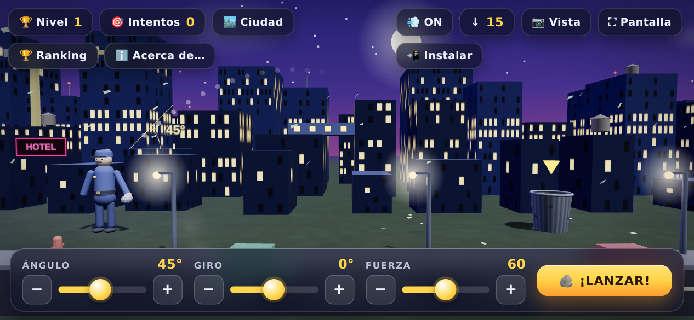
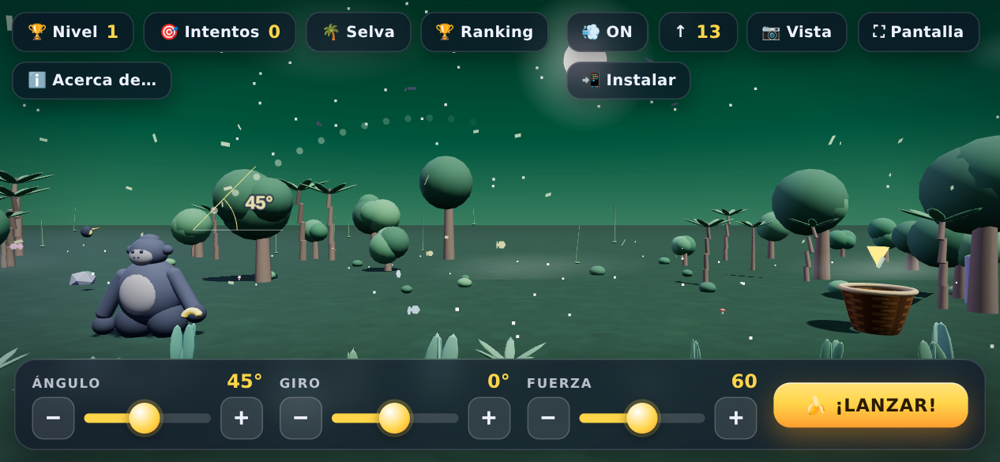
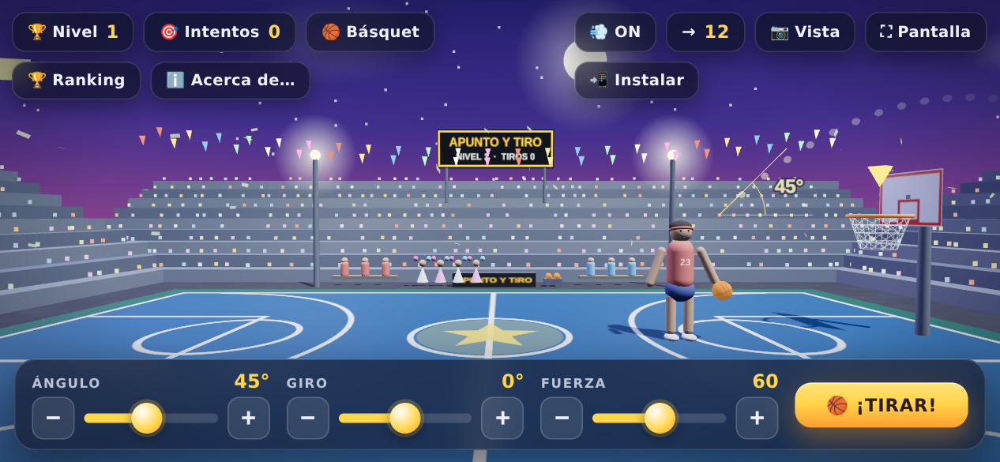
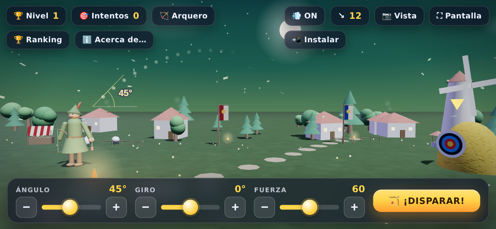
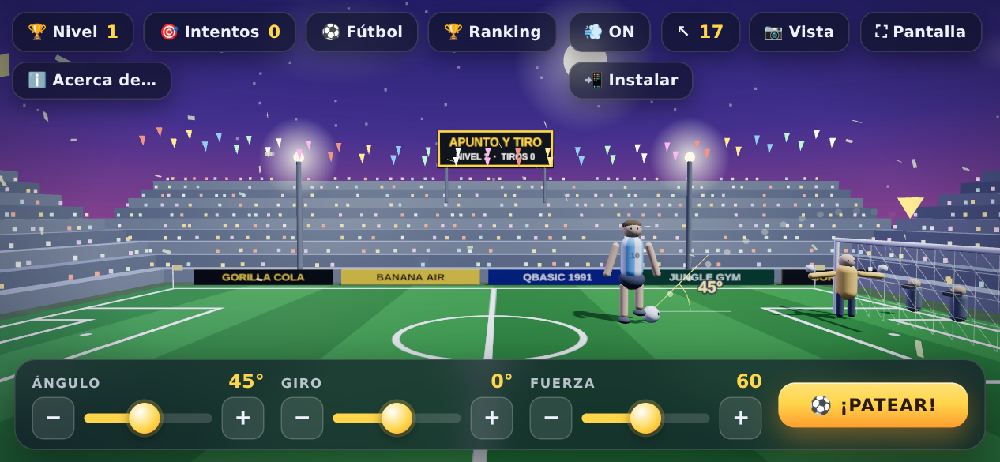
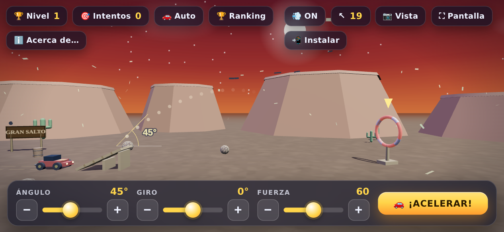
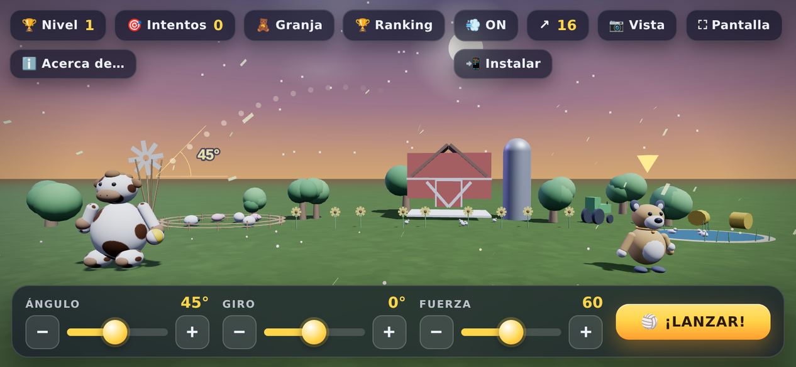

# 🎯 Apunto y Tiro

Un homenaje moderno al clásico **GORILLA.BAS** de QBasic, hecho en HTML + JavaScript con **three.js** (renderizado 3D con WebGL). Elegís **ángulo**, **giro** y **fuerza**, y la física — tiro parabólico 3D con gravedad y viento — decide si embocás. Cada acierto pasa de nivel y todo se pone más difícil.

**▶️ Jugar ahora: <https://fersca.github.io/Gorilla/>**

> Construido por **Fernando Scasserra** y su IA, para **Julián** y **Simón**, en Tandil ❤️

## Capturas

| | |
|---|---|
|  🏙️ **Ciudad** |  🌴 **Selva** |
|  🏀 **Básquet** |  🏹 **Arquero** |
|  ⚽ **Fútbol** |  🚗 **Auto** |
|  🧸 **Granja** | |

## Escenarios

El botón de escenario del HUD abre un **selector con la lista completa** para saltar directo a cualquiera de los siete:

| Escenario | Qué pasa |
|-----------|----------|
| 🏙️ **Ciudad** | Un policía practica puntería tirando piedras a un tacho de basura metálico entre los edificios. El tacho se mueve por nivel (y puede subirse a pedestales). |
| 🌴 **Selva** | El gorila en su hábitat tira bananas a un canasto de mimbre. Cascada, laguna, mariposas, tucán y luciérnagas incluidos. |
| 🏀 **Básquet** | Un jugador tira al aro (tablero, hierro y red) en un estadio con tribunas llenas. El aro es fijo: lo que cambia por nivel es **tu posición en la cancha**. |
| 🏹 **Arquero** | Un arquero medieval dispara flechas a un **blanco de aros sobre un montículo de paja**, en un bosque con aldea, molino y fogata. La flecha vuela orientada a su trayectoria y queda clavada al acertar; pegarle a la paja es fallo. |
| ⚽ **Fútbol** | Tiro libre: un jugador con la 10 patea al **arco con red**, custodiado por un **arquero que ataja** (cambia de palo por nivel). Con el nivel aparece una **barrera de rivales** cada vez más larga y **el arco se achica**. Barrera, arquero o palo = fallo. |
| 🚗 **Auto** | Salto acrobático en un desierto del viejo oeste: el auto toma una **rampa** — que se inclina con el Ángulo y gira con el Giro — y tiene que **pasar volando por dentro de un aro elevado**. La Fuerza es la velocidad; el aro sube y se gira con el nivel, y rozar el borde es fallo. |
| 🧸 **Granja** | Guerra de pelotazos entre dos peluches, como el GORILLA.BAS original: la **vaquita grandota** (blanca con manchas marrones) de un lado y el **perrito marrón** del otro se tiran una **pelota de playa** — y **cuando uno le pega al otro, el que ligó el pelotazo pasa a tirar**. Todo en una granja con granero, silo, molino, tractor, corral con ovejas, chanchos, gallinas, girasoles y una **laguna con patitos** (si la pelota cae ahí, ¡splash!). |

## Cómo jugar

- **Ángulo**, **Giro** y **Fuerza**: con los sliders, con los botones **−/+** al lado de cada uno (mantenelos apretados y repiten), o con el teclado (`↑`/`↓` ángulo, `Q`/`E` giro, `←`/`→` fuerza).
- **Lanzar**: el botón grande o la barra espaciadora.
- **Giroscopio 🧭**: el botón del menú activa el control con el **sensor del teléfono** — se ocultan los sliders y queda solo un **botoncito redondo para disparar**. La posición del teléfono al activarlo es el punto de partida: **inclinándolo sobre el eje Y** cambia el ángulo, **rotándolo sobre el eje Z** el giro y **ladeándolo sobre el eje X** la fuerza (en iPhone pide permiso para usar el sensor). Se desactiva volviendo a tocar el botón.
- **Menú plegable**: la **flechita ▾** de arriba a la derecha muestra u oculta todos los botones del HUD, para jugar con la pantalla limpia; quedan siempre a la vista el nivel, los intentos y el viento.
- **Guía de puntería**: puntitos que muestran el arranque real de la trayectoria (viento incluido), más la estela tenue del tiro anterior para corregir.
- **Indicador de ángulo 📐 (educativo)**: en el punto de disparo se dibujan el eje horizontal, la pendiente del tiro y el **arco entre ambos con los grados marcados**, actualizándose en vivo con el slider — para aprender qué significa cada ángulo.
- **Cámara estilo Google Earth**: arrastrá para orbitar (desde arriba, de costado…), rueda o pinch para zoom, dos dedos o botón derecho para panear. `📷 Vista` vuelve al encuadre inicial.
- **Viento 💨**: es un **vector 2D** — empuja adelante/atrás y **hacia los costados**, desviando el proyectil lateralmente. El chip muestra dirección (flechas de 8 rumbos) y fuerza, y las **hojitas vuelan en esa dirección exacta**. El botón lo prende/apaga; OFF garantiza tiro limpio.
- **Ranking 🏆**: récords guardados en el dispositivo por escenario — mejor nivel, emboques, intentos y efectividad. Superar tu mejor nivel se anuncia en el festejo.
- **Acerca de… ℹ️**: la dedicatoria del juego.
- **Sonidos y vibración**: cada proyectil silba distinto al salir (banana aguda, pelota grave, piedra pesada, *twang* de cuerda, motor acelerando, *¡pum!* del botín) y cada blanco suena distinto al acertar (*plop* en el mimbre, *¡clang!* metálico, *swish* de red, *¡thock!* en la paja, rugido de tribuna en el gol). Todo sintetizado con WebAudio, sin archivos de audio.

## Dificultad progresiva

Con cada nivel, en todos los escenarios:

- **El lanzador retrocede**: arranca cerca y termina contra el borde del escenario.
- **El viento sopla más fuerte** (si está ON): sube el máximo y también el mínimo, en cualquier dirección.
- **El blanco se corre más a los costados** (más Giro necesario), puede elevarse (pedestales en ciudad/selva, aro del auto más alto) y los blancos planos aparecen **girados sobre su eje**, achicando la zona útil.
- En básquet y fútbol, tu posición se aleja y se abre del eje del blanco; en fútbol además crece la barrera y se achica el arco.

## Instalar como app 📲

El botón **📲 Instalar** aparece **solo cuando el juego corre en el navegador**: si ya está abierto como app instalada (PWA en pantalla completa o app nativa de Android), el juego lo detecta al arrancar y el botón no se muestra.

Desde el navegador, el botón pregunta **cómo la querés instalar**:

- **🌐 Web App (PWA)** — recomendada: instalación nativa donde existe (Chrome/Android/Edge) o instrucciones del navegador (iPhone/Safari, Firefox…). Queda en el escritorio con el **ícono cartoon**, abre en **pantalla completa** y **funciona offline** (service worker).
- **🤖 App nativa de Android (APK)** — descarga el APK empaquetado con **Capacitor** y compilado automáticamente por GitHub Actions en cada push (release [`app-latest`](https://github.com/Fersca/Gorilla/releases/tag/app-latest)). Al instalarlo, Android puede pedir permitir *"instalar apps desconocidas"* (normal fuera de Play Store). En iPhone no hay equivalente — Apple solo permite apps vía App Store, así que ahí la vía es la PWA.

Desde el navegador, el botón **⛶ Pantalla** pone el juego en pantalla completa sin instalar nada. También podés abrir `index.html` directo desde el archivo, sin servidor ni build.

## Versiones y actualización automática ⬇️

El juego lleva un **número de versión** (arranca en la **0** y se incrementa en cada release): es la constante `GAME_VERSION` de `index.html` — única fuente de verdad — y se muestra en el cartel **Acerca de…**. En cada deploy, el workflow de Pages genera `version.json` con ese mismo número y lo publica junto al juego.

**Al abrir la app se chequea si hay actualización** (consultando `version.json`, que nunca se cachea): si el sitio publica una versión más nueva que la instalada, aparece el aviso *"¡Hay versión nueva!"*, se descarta el caché viejo y **se baja el contenido nuevo automáticamente** — la PWA/navegador recarga fresco (el service worker trae la versión nueva de la red) y la app nativa carga el sitio actualizado dentro de la misma app. Sin conexión no pasa nada: se juega con la versión que ya está en el dispositivo. Un guardián por sesión evita recargas en loop si algo falla.

Para publicar una versión nueva alcanza con **subir `GAME_VERSION` en `index.html`** y pushear: el deploy hace el resto.

## Detalles técnicos

- **three.js r147** vendoreado (`vendor/three.min.js` + `vendor/OrbitControls.js`): no necesita internet ni CDN.
- Render: sombras suaves (PCF), niebla atmosférica que empalma con la cúpula de cielo con gradiente, tone mapping ACES, pixel ratio adaptado, viñeta CSS.
- **Física determinista**: integración de Euler con **subpasos fijos de 1/120 s** — la trayectoria es idéntica a cualquier framerate — y aciertos decididos **interpolando el cruce del plano del blanco entre pasos** (aro horizontal, disco girado, línea de gol o aro vertical, según el escenario).
- Entornos 100 % procedurales, regenerados por nivel: ciudad (edificios con ventanas iluminadas, farolas, autos, grúa, puente, helicóptero patrullando, vapor, neón), selva (árboles, palmeras, cascada animada, laguna, mariposas, pájaros, bruma), estadio compartido (tribunas en U con público de puntos, flashes de cámaras, banderines, **marcador en vivo con nivel y tiros**, banderas), bosque medieval (aldea con humo en las chimeneas, molino girando, ovejas, mercado, pozo, fogata), desierto (mesetas, cactus, cuervos, rodadoras que ruedan con el viento, cartel GRAN SALTO), granja (granero, silo, molino con aspas girando, corral con animalitos, huerta, espantapájaros, girasoles y laguna con patitos nadando).
- En la **Granja** el tiro es **bidireccional**: el peluche que tira cambia según quién ligó el último pelotazo, así que la física, la guía de puntería y el indicador de ángulo funcionan igual hacia la derecha (vaquita) que hacia la izquierda (perrito).
- Personajes y blancos modelados por código, con caras, ropa y accesorios propios; proyectiles que giran en vuelo (banana/pelotas/piedra) o vuelan orientados a la trayectoria (flecha/auto).
- Efectos: nubes que derivan, estrellas fugaces, partículas de festejo y de impacto, screen-shake, estela aditiva, hojitas de viento.
- **Mobile-first**: `viewport-fit=cover` + safe areas, cámara que se reencuadra al rotar el teléfono, panel compacto en vertical (~13 % de la pantalla), botones táctiles grandes, vibración háptica.
- Récords en `localStorage`; sin dependencias de build: un solo `index.html` + vendor.

## Estructura del repo y deploy

```
index.html            el juego completo (HTML + CSS + JS)
manifest.webmanifest  metadata de la PWA
sw.js                 service worker (instalación + offline)
icons/                íconos de la app (192/512/maskable/apple)
vendor/               three.js r147 + OrbitControls (vendoreados)
android/              proyecto nativo de Android (Capacitor)
capacitor.config.json configuración de Capacitor (appId, webDir)
scripts/              build-www.js (arma www/ para Capacitor) y
                      gen-android-icons.js (íconos/splash desde icon-512)
screenshots/          capturas para el README
.github/workflows/    CI: deploy a Pages + build del APK
```

Cada push a la rama de desarrollo dispara **dos workflows**:

1. **Deploy a GitHub Pages** — genera `version.json` a partir de `GAME_VERSION` y publica el juego web en la rama `gh-pages` (no hay que tocarla a mano).
2. **Build Android APK** — `npm run sync:android` (arma `www/` y sincroniza Capacitor), compila con Gradle en el runner (que trae el SDK de Android) y publica `apunto-y-tiro.apk` en el release **`app-latest`**, que es lo que descarga el botón "App nativa" del sitio.

Para desarrollar la app nativa localmente hace falta Android Studio/SDK: `npm install && npm run sync:android` y abrir `android/` en Android Studio.
